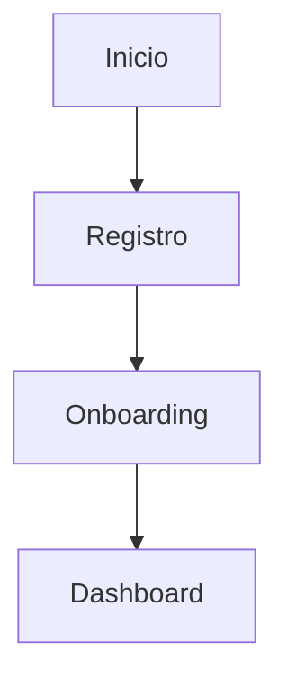
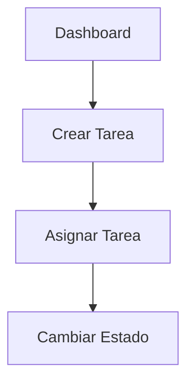

# GUIA DE TESTING - ProGest

> Guia completa de testing del sistema

---

## VISION GENERAL

El sistema ProGest utiliza multiples estrategias de testing:
- Testing de API con Postman
- Testing E2E con Playwright
- Unit tests con Pytest (backend)
- Component tests con Jest (frontend)

---

## TESTING CON POSTMAN

### Coleccion Postman

**Ubicacion:** `postman/ProGest_API_Complete.postman_collection.json`

**Environment:** `postman/ProGest_Development.postman_environment.json`

### Importar en Postman

1. Abrir Postman
2. Click en "Import"
3. Seleccionar `ProGest_API_Complete.postman_collection.json`
4. Seleccionar `ProGest_Development.postman_environment.json`
5. Seleccionar environment "ProGest - Development"

### Estructura de la Coleccion

**41 endpoints organizados en 8 carpetas:**

1. **Health & Status** (2 endpoints)
   - GET / - Health check raiz
   - GET /api/health - Health check API

2. **Auth** (6 endpoints)
   - POST /api/auth/register
   - POST /api/auth/login
   - GET /api/auth/me
   - POST /api/auth/refresh
   - POST /api/auth/logout
   - POST /api/auth/accept-invite

3. **Projects** (2 endpoints)
   - POST /api/projects
   - GET /api/projects/my-project

4. **Invites** (5 endpoints)
   - POST /api/invites
   - GET /api/invites
   - DELETE /api/invites/:id
   - GET /api/invites/validate/:token
   - POST /api/invites/:id/resend

5. **Members** (3 endpoints)
   - GET /api/members
   - PATCH /api/members/:id/deactivate
   - PATCH /api/members/:user_id/profile

6. **Tasks** (9 endpoints)
   - POST /api/tasks
   - GET /api/tasks
   - GET /api/tasks/:id
   - PATCH /api/tasks/:id
   - DELETE /api/tasks/:id
   - GET /api/tasks/my-tasks
   - PATCH /api/tasks/:id/assign
   - PATCH /api/tasks/:id/status
   - GET /api/tasks/stats

7. **Notifications** (5 endpoints)
   - GET /api/notifications
   - GET /api/notifications/unread-count
   - PATCH /api/notifications/:id/read
   - PATCH /api/notifications/read-all
   - DELETE /api/notifications/:id

8. **Comments** (4 endpoints)
   - GET /api/tasks/:task_id/comments
   - POST /api/tasks/:task_id/comments
   - PATCH /api/tasks/:task_id/comments/:id
   - DELETE /api/tasks/:task_id/comments/:id

9. **Admin** (7 endpoints)
   - GET /api/admin/users
   - GET /api/admin/projects
   - GET /api/admin/audit-logs
   - PATCH /api/admin/users/:id/status
   - PATCH /api/admin/projects/:id/status
   - GET /api/admin/stats
   - GET /api/admin/health

### Flujo de Testing Recomendado

**1. Registro y Login (OWNER)**
```
1. POST /api/auth/register (OWNER)
   - Guarda access_token y refresh_token
2. POST /api/auth/login
   - Verifica tokens
3. GET /api/auth/me
   - Verifica datos del usuario
```

**2. Crear Proyecto**
```
4. POST /api/projects
   - Crea proyecto del OWNER
5. GET /api/projects/my-project
   - Verifica proyecto creado
```

**3. Invitar Empleado**
```
6. POST /api/invites
   - Invita empleado por email
7. GET /api/invites
   - Lista invitaciones
8. GET /api/invites/validate/:token
   - Valida token de invitacion
```

**4. Aceptar Invitacion (EMPLOYEE)**
```
9. POST /api/auth/accept-invite
   - Acepta invitacion con token
   - Guarda tokens del empleado
```

**5. Gestion de Tareas**
```
10. POST /api/tasks (OWNER)
    - Crea tarea
11. GET /api/tasks
    - Lista tareas
12. PATCH /api/tasks/:id/assign
    - Asigna tarea a empleado
13. GET /api/tasks/my-tasks (EMPLOYEE)
    - Empleado ve sus tareas
14. PATCH /api/tasks/:id/status
    - Cambia estado de tarea
```

**6. Comentarios**
```
15. POST /api/tasks/:task_id/comments
    - Crea comentario
16. GET /api/tasks/:task_id/comments
    - Lista comentarios
```

**7. Notificaciones**
```
17. GET /api/notifications
    - Lista notificaciones
18. GET /api/notifications/unread-count
    - Contador de no leidas
19. PATCH /api/notifications/:id/read
    - Marca como leida
```

### Variables de Environment

```json
{
  "base_url": "http://localhost:5000",
  "access_token": "",
  "refresh_token": "",
  "user_id": "",
  "project_id": "",
  "task_id": "",
  "invite_id": "",
  "invite_token": "",
  "employee_access_token": "",
  "employee_user_id": ""
}
```

Las variables se actualizan automaticamente con scripts de test.

---

## TESTING E2E CON PLAYWRIGHT

### Ubicacion

**Tests:** `playwright-tests/generated-tests/`  
**Diagramas:** `playwright-tests/flow-diagrams/`

### Configuracion

**Archivo:** `playwright.config.ts`

```typescript
export default defineConfig({
  testDir: './playwright-tests/generated-tests',
  use: {
    baseURL: 'http://localhost:3000',
    trace: 'on-first-retry',
  },
  projects: [
    {
      name: 'chromium',
      use: { ...devices['Desktop Chrome'] },
    },
  ],
})
```

### Ejecutar Tests

```bash
# Instalar navegadores (primera vez)
npx playwright install

# Ejecutar todos los tests
npx playwright test

# Ejecutar test especifico
npx playwright test 01-owner-registration.spec.ts

# Modo UI
npx playwright test --ui

# Modo debug
npx playwright test --debug
```

### Tests Disponibles

**01-owner-registration.spec.ts**
- Registro de OWNER
- Creacion de proyecto
- Onboarding completo

**Flujos Pendientes:**
- Login de empleado
- Invitacion de empleado
- Gestion de tareas

### Diagramas de Flujo

**01-owner-registration.mmd**


**04-task-management.mmd**


---

## CREAR USUARIO SUPERADMIN

### Opcion 1: Script SQL

```sql
-- Generar password hash primero con bcrypt
-- Password: admin123
-- Hash: $2b$12$...

INSERT INTO users (
    id,
    email,
    password_hash,
    name,
    role,
    status,
    created_at
) VALUES (
    UUID(),
    'admin@progest.com',
    '$2b$12$LQv3c1yqBWVHxkd0LHAkCOYz6TtxMQJqhN8/LewY5idm6L8.WrUQy',
    'Super Admin',
    'SUPERADMIN',
    'active',
    NOW()
);
```

### Opcion 2: Script Python

```python
# generate_superadmin.py
from werkzeug.security import generate_password_hash
import uuid

email = 'admin@progest.com'
password = 'admin123'
name = 'Super Admin'

password_hash = generate_password_hash(password)
user_id = str(uuid.uuid4())

print(f"INSERT INTO users (id, email, password_hash, name, role, status, created_at)")
print(f"VALUES ('{user_id}', '{email}', '{password_hash}', '{name}', 'SUPERADMIN', 'active', NOW());")
```

### Opcion 3: Endpoint de Registro

```bash
curl -X POST http://localhost:5000/api/auth/register \
  -H "Content-Type: application/json" \
  -d '{
    "email": "admin@progest.com",
    "password": "admin123",
    "name": "Super Admin",
    "role": "SUPERADMIN"
  }'
```

### Verificar SUPERADMIN

```bash
# Login
curl -X POST http://localhost:5000/api/auth/login \
  -H "Content-Type: application/json" \
  -d '{
    "email": "admin@progest.com",
    "password": "admin123"
  }'

# Acceder a endpoint de admin
curl -X GET http://localhost:5000/api/admin/users \
  -H "Authorization: Bearer <access_token>"
```

---

## UNIT TESTING (BACKEND)

### Setup

```bash
cd project-management-backend
pip install pytest pytest-flask
```

### Estructura

```
tests/
├── __init__.py
├── conftest.py              # Fixtures
├── test_auth.py             # Tests de autenticacion
├── test_tasks.py            # Tests de tareas
├── test_invites.py          # Tests de invitaciones
└── test_permissions.py      # Tests de permisos
```

### Ejemplo de Test

```python
# tests/test_auth.py
import pytest
from app import create_app, db
from app.models import User

@pytest.fixture
def client():
    app = create_app('testing')
    app.config['SQLALCHEMY_DATABASE_URI'] = 'sqlite:///:memory:'
    
    with app.test_client() as client:
        with app.app_context():
            db.create_all()
        yield client
        with app.app_context():
            db.drop_all()

def test_register_success(client):
    response = client.post('/api/auth/register', json={
        'email': 'test@test.com',
        'password': 'password123',
        'name': 'Test User',
        'role': 'OWNER'
    })
    
    assert response.status_code == 201
    data = response.get_json()
    assert data['success'] == True
    assert 'access_token' in data

def test_register_duplicate_email(client):
    # Primer registro
    client.post('/api/auth/register', json={
        'email': 'test@test.com',
        'password': 'password123',
        'name': 'Test User'
    })
    
    # Segundo registro con mismo email
    response = client.post('/api/auth/register', json={
        'email': 'test@test.com',
        'password': 'password456',
        'name': 'Test User 2'
    })
    
    assert response.status_code == 400
    data = response.get_json()
    assert data['success'] == False

def test_login_success(client):
    # Registrar usuario
    client.post('/api/auth/register', json={
        'email': 'test@test.com',
        'password': 'password123',
        'name': 'Test User'
    })
    
    # Login
    response = client.post('/api/auth/login', json={
        'email': 'test@test.com',
        'password': 'password123'
    })
    
    assert response.status_code == 200
    data = response.get_json()
    assert 'access_token' in data
    assert 'refresh_token' in data
```

### Ejecutar Tests

```bash
# Todos los tests
pytest

# Test especifico
pytest tests/test_auth.py

# Con coverage
pytest --cov=app tests/

# Verbose
pytest -v
```

---

## COMPONENT TESTING (FRONTEND)

### Setup

```bash
cd project-management-frontend
npm install --save-dev jest @testing-library/react @testing-library/jest-dom
```

### Ejemplo de Test

```typescript
// __tests__/components/Button.test.tsx
import { render, screen, fireEvent } from '@testing-library/react'
import { Button } from '@/components/ui/button'

describe('Button Component', () => {
  it('renders button with text', () => {
    render(<Button>Click me</Button>)
    expect(screen.getByText('Click me')).toBeInTheDocument()
  })
  
  it('calls onClick when clicked', () => {
    const handleClick = jest.fn()
    render(<Button onClick={handleClick}>Click me</Button>)
    
    fireEvent.click(screen.getByText('Click me'))
    expect(handleClick).toHaveBeenCalledTimes(1)
  })
  
  it('applies variant classes', () => {
    render(<Button variant="destructive">Delete</Button>)
    const button = screen.getByText('Delete')
    expect(button).toHaveClass('bg-destructive')
  })
})
```

### Ejecutar Tests

```bash
# Todos los tests
npm test

# Watch mode
npm test -- --watch

# Coverage
npm test -- --coverage
```

---

## TESTING DE INTEGRACION

### Flujo Completo: Registro -> Proyecto -> Tarea

```python
def test_complete_flow(client):
    # 1. Registrar OWNER
    response = client.post('/api/auth/register', json={
        'email': 'owner@test.com',
        'password': 'password123',
        'name': 'Owner User',
        'role': 'OWNER'
    })
    access_token = response.get_json()['access_token']
    
    # 2. Crear proyecto
    response = client.post('/api/projects', 
        headers={'Authorization': f'Bearer {access_token}'},
        json={
            'name': 'Test Project',
            'description': 'Test Description',
            'category': 'software'
        }
    )
    project_id = response.get_json()['project']['id']
    
    # 3. Crear tarea
    response = client.post('/api/tasks',
        headers={'Authorization': f'Bearer {access_token}'},
        json={
            'title': 'Test Task',
            'description': 'Test Description',
            'priority': 'high',
            'due_date': '2026-12-31T23:59:59'
        }
    )
    
    assert response.status_code == 201
    task = response.get_json()['task']
    assert task['title'] == 'Test Task'
    assert task['project_id'] == project_id
```

---

## METRICAS DE TESTING

### Coverage Objetivo

- Backend: 80% coverage minimo
- Frontend: 70% coverage minimo
- Endpoints criticos: 100% coverage

### Tipos de Tests

- Unit tests: 60%
- Integration tests: 30%
- E2E tests: 10%

---

**Ultima actualizacion:** 24 de febrero de 2026  
**Version:** 2.0.0
